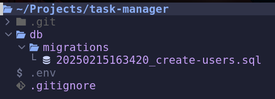

## Introduction

Let me start this off by saying one thing, I am not a fan of ORM
(Object Relational Mappers).
If this bothers you, feel free to leave this article.
The issue I have with ORM's is that abstracts away SQL, which is already a very
declarative way of writing data workflows.
It is declarative in the sense that you write out what you want the
result to look like,opposed to an imperative paradigm where you write
out the explicitly steps to arrive at the result.

However, the good quality of ORM's is that they allow you to easily map
your database schema into datatypes of your programming language of choice.
This might be a dataclass or pydantic class in python, or a struct in golang.
If you just use the built in database drivers, you often have to self
manage the mapping raw tuples to/from the database driver into your datatypes.
This results in far more boiler plate in the codebase going back and forth between
the desired datatype and tuples.
To be fair though, many database drivers have the concept of row factories
which allow you to map database rows directly to hash maps / classes/ structs.
However, many of often unaware of this feature and even then, it still
typically results in more boiler plate compared to the ORM.

Also, ORM's often include database migration tools, or have plugins that
allow you to do so. This makes managing your database between production
releases much easier and allow an easy mechanism to roll back in the event
of a bad release. Managing database migrations without some supporting tooling
can be a nightmare, as the onus is on the developer to organize the migration
queries.

The great news is that these two features of ORMs can also be satified
using only raw sql with the help of some additional tooling. Enter
DBMate and SQLC.

## DBMate - Migration Tool

When developing a backend database, knowing how migrations
are going to be managed needs to be one of the first considerations.
[DBMate](https://github.com/amacneil/dbmate) is a great tool in this regard, and it is agnostic of the programming
language of choice. To get started, I will build a new project for
managings a database of user's tasks. (Yeah I know, real original...)
Let's first build our directory.

```bash
~/Projects>mkdir task-manager && cd task-manager
~/Projects/task-manager>git init .
hint: Using 'master' as the name for the initial branch. This default branch name
hint: is subject to change. To configure the initial branch name to use in all
hint: of your new repositories, which will suppress this warning, call:
hint:
hint:  git config --global init.defaultBranch <name>
hint:
hint: Names commonly chosen instead of 'master' are 'main', 'trunk' and
hint: 'development'. The just-created branch can be renamed via this command:
hint:
hint:  git branch -m <name>
```

Next lets install dbmate. I am using a linux system.
If you are using a different os, refer to the
[installation instructions](https://github.com/amacneil/dbmate?tab=readme-ov-file#installation)
for your system.

```bash
~/Projects/task-manager>sudo curl -fsSL -o /usr/local/bin/dbmate https://github.com/amacneil/dbmate/releases/latest/download/dbmate-linux-amd64
sudo chmod +x /usr/local/bin/dbmate
/usr/local/bin/dbmate --help
~/Projects/task-manager>dbmate --version
dbmate version 2.25.0
```

Now that we have DBMate installed, we need to specify what database we are targeting.
For this project, I will stick to using sqlite for its simplicity of setup. We tell
DBMate which database to target by setting the `$DATABASE_URL` environment variable.
Instead of specifying this globally on my system, I will create a .env file in the project
to keep it locally stored. DBMate will know to automatically parse secrets in our .env file.

```.env
DATABASE_URL="sqlite:./db/task-manager.db"
```

We should also add any dot env files into our git ignore to prevent exposing
secrets and setting up conflicting build systems further down the line.

```.gitignore
*.env
```

Now lets add our first migration.

```
~/Projects/task-manager>dbmate new create-users
Creating migration: db/migrations/20250215163420_create-users.sql
```

We see we get a new sql file gets created. Our project file structure should now look like this.



Lets open our new sql file, and we see the following.

```sql

-- migrate:up


-- migrate:down

```

We see there are two sections: one for migrating up the database, and other to
migrate down (rollback). Lets define our steps.

```sql
-- migrate:up
create table users (
  id integer primary key,
  name text not null
);

-- migrate:down
drop table users;
```

After saving this file, we now can check the status of our migrations.

```bash
~/Projects/task-manager>dbmate status
[ ] 20250215170014_create-users.sql

Applied: 0
Pending: 1
```

And then run our migration.

```bash
~/Projects/task-manager>dbmate up
Applying: 20250215170014_create-users.sql
Applied: 20250215170014_create-users.sql in 8.189239ms
Writing: ./db/schema.sql
```

DBMate creates our database and creates the users table. To test it out,
run the following in your favorite db query utility.
(I use [neovim Dadbod plugin](https://github.com/kristijanhusak/vim-dadbod-ui))

```sql
insert into users (name) values ('test');
select * from users;
```

And you should see your test user returned back.

To roll back, run the following.

```bash
~/Projects/task-manager>dbmate rollback
Rolling back: 20250215170014_create-users.sql
Rolled back: 20250215170014_create-users.sql in 3.702276ms
Writing: ./db/schema.sql
```

Now we should have an empty database again.

To test that, run the following.

```sql
select * from users;
```

And you should see an empty result set.

## SQLC

SQLC is a tool that allows you to easily generate Go code from SQL queries.
Unlike ORMs, it will read through our raw sql schema and queries, and generate
Go code that you can use to interact with your database. All the boiler plate
of managing the database drivers and mapping raw tuples to/from Go data types
is taken care of for us.

First, we need to install it.

```bash
~/Projects/task-manager>sudo snap install sqlc
~/Projects/task-manager>sqlc version
v1.28.0
```

If you are using a different os, refer to the [installation instructions](https://docs.sqlc.dev/en/latest/overview/install.html).
Next we need to let SQLC know some things about our database.

1. Database schema
2. Database queries
3. Database driver
4. Go module name
