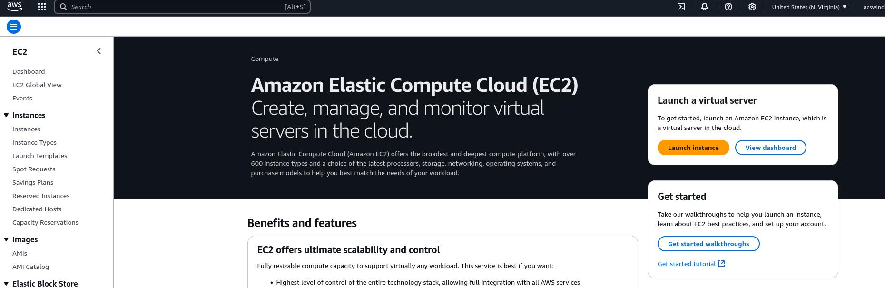

## Introduction

[Last time](), we saw
how to create a Docker image for our Go API. Now that we have
our image, we can deploy it from any machine that has Docker.

## Setting up AWS Account

If you don't have an AWS account, you can sign up for free
[here](https://signin.aws.amazon.com/signup?request_type=register).
After signing up, you should be able to access the AWS console, which looks
like the following.


This is the area where you can see all your AWS resources and monitor usage.
The service we are going to use is EC2, which is a cloud service that allows
us to run a virtual private server in the cloud. We will connect to our EC2
instance using the SSH protocol. (So all those linux commands you have been
practicing will come to good use here. You have been practicing, haven't you?)

## Creating an EC2 Instance

To create our instance, type `EC2` into the search bar on the upper left hand
corner of the console. This will take you to the EC2 page.



Click the "Launch Instance" button, which will take you to the launch instance
page. This page should look like the following.


Now let's start filling out the configuration information for our VPS.
Let's name our instance `task-manager` and select the Ubuntu 24.04 LTS
as our operating system. This is the most recent version of Ubuntu at the time
of this writing. If you see a newer version, please go ahead and select that version.

For our instance type, let's select `t2.micro`.
This is the smallest instance and is more than enough for our simple application.
Furthermore, it is free to use.

Since we are going to exposing the SSH port of our server, we should set up
a key pair as an additional security measure to prevent malicious users from
logging into our server. Click on the `Create Key Pair` button, which will
open a new window. Name the key pair `task-manager-keypair`. You can leave
the remaining fields as default. (I assume you are developing on a linux or mac.
If using a windows, feel free to select `.ppk` instead of `.pem`.
However, consider using WSL if you are windows user.)
You should see a file called `task-manager-keypair.pem` in your downloads directory.
Move this file into your `~/.ssh` directory by running

```bash
mv ~/Downloads/task-manager-keypair.pem ~/.ssh
```

On the networking section, you can leave all as the defaults except also select
the `Allow HTTP traffic from the internet` and
`Allow HTTPS traffic from the internet` options.
This will allow users to access our Go API from the internet.
The rest of this section pertains to a VPC, which is a virtual private
network. We can ignore this for now since we are just managing a single instance.
In the case of a more complex application, you may want to create a VPC to
isolate your resources.

Finally for the storage, we can leave it at the defaults. This will ensure
we remain in the free tier. As of this writing, the free tier allows up to 30
GB of disk space, which is more than enough for our OS, application, and database.

## Starting the Instance

Now select the `Launch Instance` button, which will start up our instance.
After the instance is up, select the `Connecting to your instance` button.
On this page, click on the `SSH Client` tab.
Next, naviate to your `~/.ssh` directory and run the following command.

```bash
chmod 400 task-manager-keypair.pem
```

Finally, copy the SSH command under the `example:` text and paste it into your
terminal. If all went well, you should see a message asking you to accept the
key. You can do this by typing `yes` and then pressing enter.

You should now be connected to the terminal of your EC2 instance. I recommend
opening your ssh sessions inside a tmux session. This will allow you to close out
terminal without losing your ssh session.

## Configuring the Instance

Now that we have our server up and running, we need to do some house keeping.

First, we should install updates. Run the following command.

```bash
sudo apt-get update
sudo apt-get upgrade
```

Now let's install docker our the machine.

```bash
# Add Docker's official GPG key:
sudo apt-get update
sudo apt-get install ca-certificates curl
sudo install -m 0755 -d /etc/apt/keyrings
sudo curl -fsSL https://download.docker.com/linux/ubuntu/gpg -o /etc/apt/keyrings/docker.asc
sudo chmod a+r /etc/apt/keyrings/docker.asc

# Add the repository to Apt sources:
echo \
  "deb [arch=$(dpkg --print-architecture) signed-by=/etc/apt/keyrings/docker.asc] https://download.docker.com/linux/ubuntu \
  $(. /etc/os-release && echo "${UBUNTU_CODENAME:-$VERSION_CODENAME}") stable" | \
  sudo tee /etc/apt/sources.list.d/docker.list > /dev/null
sudo apt-get update
```

And install with the following command.

```bash
sudo apt-get install docker-ce docker-ce-cli containerd.io docker-buildx-plugin docker-compose-plugin
```

Then we verify our install by running

```bash
sudo docker run hello-world
```

And if you see the message `Hello from Docker!`, you are good to go.

We will need to set up our sqlite database by using dbmate. So let's install it.

```bash
sudo curl -fsSL -o /usr/local/bin/dbmate https://github.com/amacneil/dbmate/releases/latest/download/dbmate-linux-amd64
sudo chmod +x /usr/local/bin/dbmate
```

And let's clone our repo to get access to our migrations.

```bash
git clone https://github.com/acswindle/task-manager.git
cd task-manager
dbmate migrate
```

Create a new `.env` file with you database and application settings
(don't use port 80, we will address this later).

And now let's run our docker image.

```bash
sudo docker compose up -d
```

## Configuring Nginx

Now that we have our instance up and running. However, we will not be able
to access from the outside since it is not running on port 80. We will
use Nginx to act as a reverse proxy and forward all traffic on port 80
to our application.

First let's install Nginx.

```bash
sudo apt-get install nginx
```

And replace the `http` section of our `/etc/nginx/nginx.conf` file with the following.

```nginx
http {
    server {
        listen 80;
        location / {
          proxy_pass http://127.0.0.1:8080;
          proxy_set_header Host $host;
          proxy_set_header X-Real-IP $remote_addr;
          proxy_set_header X-Forwarded-For $proxy_add_x_forwarded_for;
          proxy_set_header X-Forwarded-Proto $scheme;
        }
    }
}
```

And then we restart nginx.

```bash
sudo nginx -t
sudo systemctl restart nginx
```

## Testing the Application

If all went well, you should now be able to access the application on our EC2
instance. Find the public IP address of your instance, and try
running the following command.

```bash
curl -s -X 'GET' 'http://<PUBLIC_IP_ADDRESS>'
```

And you should see `Writing from Go Server`.

## Conclusion

So that's how to set up an EC2 instance and host a Go application on it.
In the next post, we will see how to automate our build process using
GitHub Actions to update our EC2 instance when we push changes into
the master branch of our repo.

Until next time! 🍻
