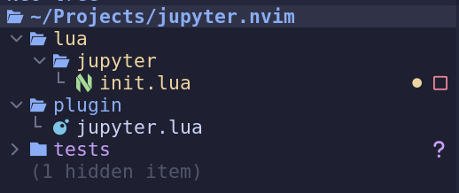

## Introduction

I love NeoVim. However, there are times as a data scientist that I
really need the interactive experience of what Jupyter provides.
I have looked into various plugins for neovim, but none of them
seem to work at the level I would prefer. Whenever I find myself
in the need of an interactive environment, I end up opening
VSCode and using Jupyter interactively from my `.py` files using the
special `#%%` comment blocks.

Today, I decided to no longer keep this last thing from keeping me
from developing soley in neovim. Time to embark on my first NeoVim
plugin!

## Requirements

I want to make the requirements for this plugin initially as simple as possible.

1. Connect to a Jupyter Server
2. Run the code contained within #%% blocks in the current buffer where
   the cursor is currently located
3. Display the results in a new buffer and window.
4. Close the connection when the buffer is closed.

I realize that this is a very simple plugin, but I want to make it as
simple as possible to get started.

## Projet Setup

First, lets create a new directory called `jupyter-nvim` and create the
following structure.



Our `/lua/jupyter/init.lua` will contain the bulk of our plugin's code.
The `/plugin/jupyter.lua` contains the code we want neovim to execute
on startup. This will mostly be the vim commands we want to associate
with the function in our `init.lua` file.The `tests` directory will contain
some http testing files to test our connection with the Jupyter server and
some python files we can test our plugin with.

In our `lua/jupyter/init.lua` file, we create the following

```lua
local M = {}

function M.test()
 print("Calling From Jupyter Plugin!")
end

return M
```

Here we create a function called test our a table M.
M is a common conventions in neovim plugins for storing
the plugin api.

In our `plugin/jupyter.lua` file, we create the following

```lua
if vim.g.loaded_jupyter then
 return
end
vim.g.loaded_jupyter = true

-- Add any global commands or autocommands here

vim.api.nvim_create_user_command("JupyterTest", function()
 require("jupyter").test()
end, {})
```

Here we check if our plugin has already been loaded and exit if it has.
Next, we create a neovim command called `JupyterTest` that will call
our `test` function from our `init.lua` file.

Finally, to regist our plugin, we need to add the following into our
`.config/nvim/lua/plugins/jupyter.lua` into our lazyvim config.
(Assuming you are using lazy as your plugin manager)

```lua
return {
  dir = "path/to/your/project/jupyter.nvim", -- Your path
  name = "jupyter",
  config = function()
    require("jupyter")
  end,
}
```

This will register our plugin with lazyvim. Finally, if we reload neovim, we should
be able to run `:JupyterTest` and see the output of our `test` function.

Our plugin is now working!

## Connecting to a Jupyter Server

We will need to communicate with our Jupyter server using http and websockets.
When you start a jupyter server, you will see an output similar to the following.

```bash
Jupyter server running at http://127.0.0.1:8888/?token=abc123
```

The token query parameter is what we will need to authenticate with the server
and create a kernel to run our code on.

Using our token we want to make the following http request.

```http
POST http://localhost:8888/api/kernels?token={{token}}
```

And we should see something like the following in the body of our response.

```json
{
  "id": "557fb118-3d4d-4703-b895-db1ee62b54a6",
  "name": "python3",
  "last_activity": "2025-02-20T04:15:06.379907Z",
  "execution_state": "starting",
  "connections": 0
}
```

This creates a kernel that we can connect to and run our code.
What we need is the id of the kernel to later connect to the web socket endpoint.
Let's modify our `init.lua` file to create a function called `connect`

```lua
local M = {}

function M.connect(token)
 if M.kernel ~= nil then
  print("Already connected")
  return
 end
 if token == nil then
  print("Add token first")
  return
 end
 local port = "8888"
 M.port = port
 M.token = token
 local curl = require("plenary.curl")
 local response = curl.post("http://127.0.0.1:" .. port .. "/api/kernels?token=" .. M.token, {})
 if response.status ~= 201 then
  print("Error Connecting: " .. response.body)
  M.token = nil
  M.port = nil
  return
 end
 M.kernel = vim.json.decode(response.body).id
 print("Connected to Jupyter Server. Kernel ID: " .. M.kernel)
end

return M
```

First, we want to abort if we already have a kernel id saved in our api table.
Next, we check to make sure the user has provided a token.
For the time being, we hard code the port to 8888, which we will later address.
Since we need to make a post request, we will use the `plenary.curl` library.
We make the post request, and send an error message to the user if we don't get back
the 201 created status code.
Finally, we decode the reponse body and save the kernel id in our api table.
If all went well, we print out a message to the user letting them know we were
able to connect to the server.

In order to test our connection, we can create the `JupyterConnect` command in our `plugin/jupyter.lua` file.

```lua {linenos=table,hl_lines=["7-9"]}
if vim.g.loaded_jupyter then
 return
end
vim.g.loaded_jupyter = true

-- Add any global commands or autocommands here
vim.api.nvim_create_user_command("JupyterConnect", function(opts)
 require("jupyter").connect(opts.args)
end, { nargs = 1 })
```

We can reloade NeoVim and test our connection by running
`:JupyterConnect <token>`, and we should somthing like the following

`Connected to Jupyter Server. Kernel ID: 487257c8-d581-400b-b12e-1b2a9fd2a2b3`

And we have successfully connected to our Jupyter server from our lua plugin.

## Setting up a Websocket Connection
